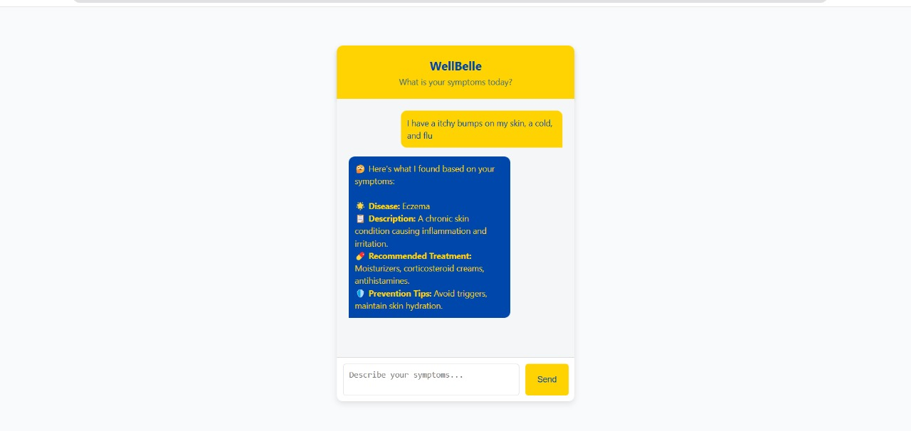

# Medical-Chatbot
This is an AI-powered Medical Chatbot developed using Python and a Naive Bayes classifier. The chatbot is designed to analyze user-inputted symptoms and predict possible diseases, provide treatment recommendations, and suggest preventive measures. It's a lightweight, text-based assistant that helps users gain preliminary health insights.

**Features**:
1. Symptom Analysis: Users input symptoms in natural language.
2. Disease Prediction: The bot suggests the most probable disease based on the input.
3. Treatment Advice: Recommends basic treatments for the predicted illness.
4. Prevention Tips: Provides advice to prevent future occurrences.
5. Simple AI Model: Uses Naive Bayes for fast and efficient predictions.

**Tech Stack**:
Language: Python
Model: Naive Bayes Classifier 
Libraries: scikit-learn, nltk, pandas, flask

# How it works?
The Medical Chatbot begins by accepting input from the user in the form of symptoms described in plain text. These symptoms are then preprocessed so that they can be matched effectively against the symptom data in the trained dataset. Once the symptoms are processed, the chatbot applies a Naive Bayes classification algorithm to predict the most likely disease based on the input. This model has been trained on a labeled dataset that maps combinations of symptoms to specific diseases.

After making a prediction, the chatbot doesn't stop at just naming the disease. It also provides a detailed description of the illness to help the user understand what the disease is and how it commonly presents. Furthermore, it offers actionable advice by suggesting common treatments, such as rest, hydration, or medications. In addition to that, the chatbot also gives prevention tips to help the user avoid contracting or spreading the disease in the future. This end-to-end process allows the chatbot to serve as a preliminary health advisor, offering quick insights and guidance in a conversational format.

# Preview

# Collaborators
Team works, make the things work!🛠️. This project wouldn’t be the same without the valuable input and support from @hwasyui ((https://github.com/hwasyui). Thank you for the huge contributions for this project!

